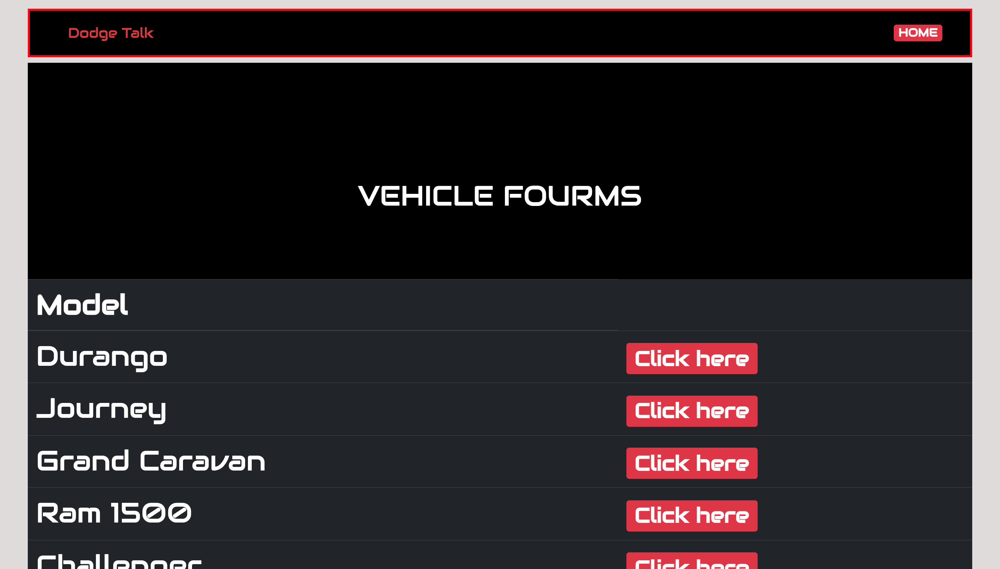
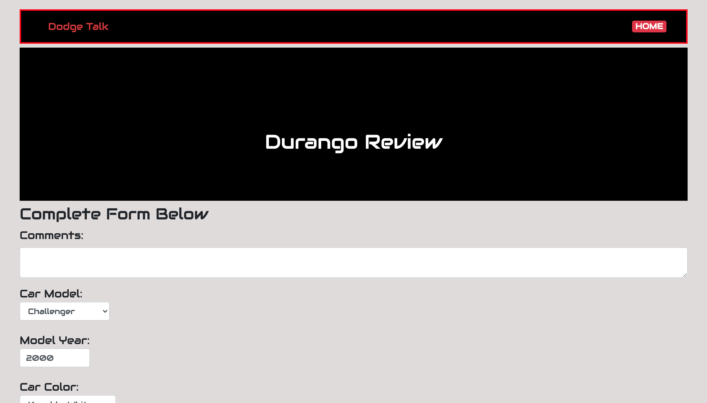
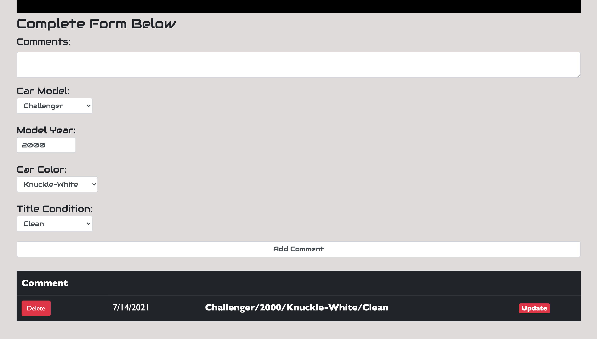
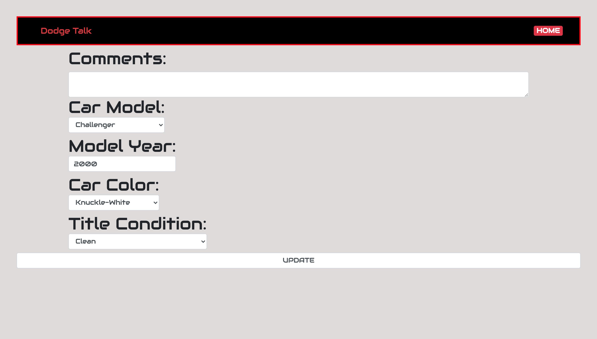

# Dodge Talk

## App Description
Dodge Talk is a site/application that allows users who own Dodge vehicles from year 2000 to present to discuss their experiences with their vehicles and also view others experiences as well. Dodge Talk allows you to choose specificications to help you and other users narrow down their search. The user can create a comment, delete their comment, and update their comment.

## Background Info
Currently Dodge is manafacturing seven different models, obviously in the past there have been many more but these seven are the most relevant. Each one of these vehicles has various trim levels as well.

## Screenshots

## Technologies Used
* Mongoose
* Express
* Node
* HTML, CSS, JS
* Bootstrap

# Getting Started
[Here is the Application!](https://project-two-kevin.herokuapp.com/cars)
[Link to my Trello Board](https://trello.com/b/qMY9zHn3/project-2-cars)

## Icebox Features
* I want to add multiple trim levels for each model such as the Dodge Challenger R/T or the Dodge Challenger Hellcat.
* I would like to create links in the navbar to allow users to switch to each model easily
* I would like to create more specific color options for each vehicle as they all technically have their own color names
* Allow users to post images for each post
* Create user authentification so only the user who posted a comment can delete or update that same comment
